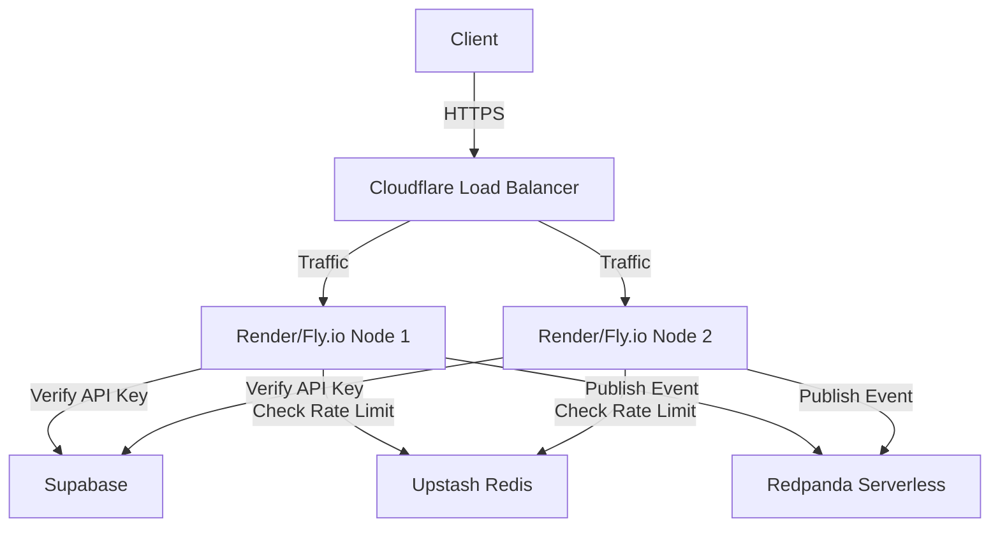

# Zero-Cost Enterprise Infrastructure Setup

This document outlines the architecture and setup instructions for running the Marketing Simulation engine with enterprise-grade load balancing, API management, and event streaming—all while maintaining a **$0/month** cost baseline.

---

## 1. Architecture Overview

### Components
1. **Load Balancer & Edge Routing:** Cloudflare (Free Tier)
2. **Authentication & Database:** Supabase (Free Tier)
3. **API Key Rate Limiting:** Upstash Redis (Free Tier)
4. **Event Streaming:** Redpanda Cloud Serverless (Free Tier) or Local Docker
5. **Compute / Web Server:** Render / Fly.io (Free Tier)



---

## 2. Load Balancing (Cloudflare)

Cloudflare acts as the edge gateway and load balancer.

### Setup Instructions
1. Add your domain to Cloudflare.
2. Go to **Traffic > Load Balancing**.
3. Create a new Load Balancer (or use standard DNS proxying with multiple A records to different backend instances if you want absolutely $0, as Cloudflare LB requires a $5/mo add-on, but Round-Robin DNS is free).
   - *Zero-Cost Hack:* Set up 2 backend services on Render/Fly.io. Create 2 CNAME records in Cloudflare pointing to the same subdomain (e.g., `api.yourdomain.com`). Cloudflare will automatically round-robin traffic between them for free.
4. Enable **Under Attack Mode** or WAF rules to drop malicious traffic at the edge.

---

## 3. Rate Limiting (Upstash Redis)

Upstash provides serverless Redis with 10k requests/day for free. We use it to implement the sliding window rate limiter in `src/api/unified.py`.

### Setup Instructions
1. Create an account at [Upstash](https://upstash.com/).
2. Create a new Redis Database.
3. Copy the **REST URL** and **REST Token**.
4. Set them in your environment variables:
   ```bash
   UPSTASH_REDIS_REST_URL=https://...
   UPSTASH_REDIS_REST_TOKEN=your-token...
   ```

---

## 4. Event Streaming (Redpanda)

Redpanda is a Kafka-compatible streaming platform.

### Local Development
We have included a `docker-compose.yml` to spin up a local Redpanda broker and the Redpanda Console.
```bash
docker-compose up -d redpanda console
```
- Redpanda broker available at `localhost:19092`.
- Redpanda console available at `http://localhost:8080`.

### Production Deployment (Serverless)
1. Go to [Redpanda Cloud](https://redpanda.com/).
2. Create a Serverless cluster (Free Tier).
3. Create topics: `simulation_started`, `simulation_completed`.
4. Copy the Bootstrap Server URL and SASL/SCRAM credentials.
5. Set the environment variable:
   ```bash
   KAFKA_BROKER=your-cluster.redpanda.com:9092
   ```

---

## 5. Security & RBAC

- **Role-Based Access Control (RBAC)** is enforced in the UI (`auth_ui.py`) and API routes.
- **API Keys** are generated and stored in Supabase with `sha256` hashing. Raw keys are never stored.
- All database tables enforce **Row Level Security (RLS)** in `schema.sql`.

---

## Conclusion
By combining these serverless providers, you achieve a scalable, event-driven, rate-limited, load-balanced enterprise SaaS without upfront infrastructure costs. As your user base scales and generates revenue, you can seamlessly transition to paid tiers.
