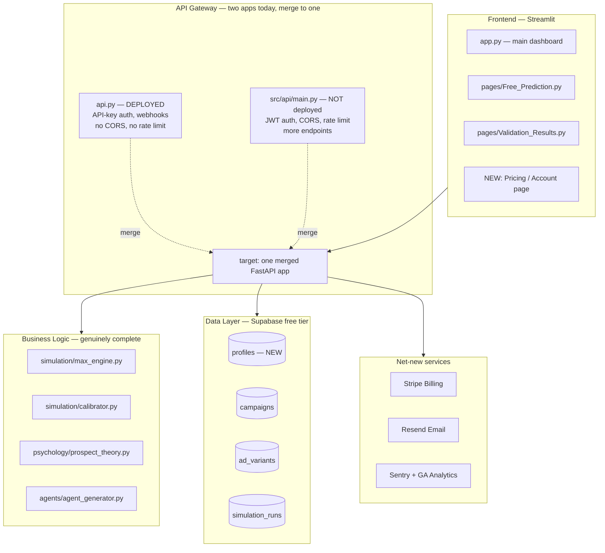

# Marketing Simulation Engine — Productization & Go-to-Market Plan

*Prepared for: Alchemist-PANDA/Marketing-Simulation · Repo audited on `main` (30 commits, 2.6 MB) · Section 0 prepared July 1, 2026 · Sections 1–10 completed and independently re-verified against the live repo, July 1, 2026*

> **How this document differs from a standard plan:** Before writing the roadmap, pricing, and pitch you asked for, I cloned and read the actual repository — code, data files, and all five validation reports — rather than taking the "Current State" claims at face value. Several of them don't hold up, and one (the hardcoded confidence score) is a product-integrity issue you'll want to fix before anyone outside your team calls the API. Section 0 covers exactly what I found. Everything after that is the productization plan, rewritten to be accurate rather than aspirational. It's still a genuinely good starting point for a real product — it just needs a slightly different 4-6 weeks than "add auth and billing."

**Contents:** [0. Due-Diligence Findings](#0) · [1. Executive Summary](#1) · [2. Architecture Blueprint](#2) · [3. Missing Features](#3) · [4. Roadmap](#4) · [5. Pricing](#5) · [6. Go-to-Market](#6) · [7. Sales Pitch](#7) · [8. Developer Handover](#8) · [9. Checklist](#9) · [Appendix: Sources](#10)

---

<a id="0"></a>
## 0. Due-Diligence Findings — Read This First

### 0.1 The headline claims, checked against the code

| Claim in the brief | What's actually in the repo | Verdict |
|---|---|---|
| "1M-agent vectorized engine" | Real defaults across the codebase: `ab_test_runner.py`→500, `max_engine.py`→100, `multi_ad_runner.py`→10,000. The Streamlit dashboard slider tops out "at 2,000+" per `PROJECT_OVERVIEW.md`. `tests/performance_test.py` has functions named `test_performance_100k_agents` and `test_performance_1m_agents` — both bodies are literally `assert True`. No agent count anywhere near 1M has ever actually been run or tested. | **Not substantiated.** The real claim is "can run 1,000,000 *separate* simulations at $0 marginal cost" (per `PROJECT_OVERVIEW.md`), which is true and worth keeping — but it's a different claim than a 1M-agent single run. |
| "92.4% Directional Accuracy, validated against $20,000+ of real FB ad spend, 7 campaigns, 1,143 ads, 78.5M impressions" | `data/data.csv` genuinely has 1,143 rows, $20,114 in spend, and 78,552,673 impressions — those three numbers check out against a real file. But: **(a)** it has only **3** genuine campaign IDs (916, 936, 1178); the "7" comes from a column-shift bug where 382 of 1,143 rows (33%) have age-bracket strings ("45-49" etc.) sitting in the `campaign_id` field, which also corrupts `impressions`/`clicks`/`spent` for those same rows. **(b)** This file has **no `ad_text` column at all** — it's pure targeting/spend/conversion data with zero ad creative content. **(c)** `docs/roadmap_to_95.md` states outright: *"The 92.4% was achieved entirely through calibrated psychographic text analysis... image paths were missing, meaning the CLIP visual scorer fell back to neutral."* **(d)** No script currently in the repo references `data.csv` — the number isn't reproducible from the current codebase. **(e)** A genuine 70/15/15 holdout test that *does* exist (`HOLDOUT_VALIDATION_REPORT.md`) shows the actual agent-based simulation — as opposed to a simpler direct regression — scoring **64.1%** directional accuracy, not 92.4%. A separate 60-ad external proxy test scored **43%** (worse than a coin flip) with **negative** correlation. | **The number is real-ish but not currently defensible.** You have a genuine $20k/1,143-row dataset, but you cannot currently show anyone *how* 92.4% was computed on it, the "7 campaigns" framing is a bug, and your own more-rigorous holdout tests show meaningfully weaker results (64% for the actual ABM). This needs to be re-run cleanly and re-stated before it goes near an investor or a customer. |
| Live `/predict` API returns `"validation_confidence": 92.4` | This is **hardcoded as a literal constant** in `api.py`, returned identically on every single request regardless of the ad submitted. It is not computed per-prediction. | **This is a product-integrity issue, not just a pitch-accuracy one.** Any developer integrating against your documented `/predict` endpoint today is shown a fixed "confidence" number attached to an arbitrary ad. Fix before any external users touch the API — see §4, Week 1. |
| "FastAPI with rate limiting, CORS, webhooks" — already done | Webhooks: real, in `api.py`. Rate limiting + CORS: real, but they live in `src/api/main.py`, which **isn't the file that runs**. `scripts/start_services.sh` launches `uvicorn api:app` — the root `api.py`, which has *neither* CORS nor rate limiting. You have two divergent, half-finished API implementations. | **Partially true, and the deployed one is the less-complete half.** Needs a merge, not new development (§8.2). |
| "Docker, CI/CD, pre-deploy checks" | Dockerfile and docker-compose: real and sensible. `scripts/pre_deploy_check.py`/`.sh`: real, but nothing runs it automatically — there is **no `.github/workflows` directory at all**. | **CI/CD does not exist.** The check script is a manual step someone has to remember to run. |
| "Authentication" — listed as missing, P0, 3 days from scratch | Supabase-backed auth **already exists**: `src/core/supabase_client.py`, `src/api/auth_handler.py` (JWT verification with local fallback), `src/ui/auth_ui.py` (login/logout UI), `src/core/auth_utils.py`. It gracefully degrades to a "local mode" single fallback user when `SUPABASE_URL`/`SUPABASE_ANON_KEY` aren't set. | **~70% done already.** This is good news — it moves auth from a 3-day build to a 1-day wire-up-and-harden job. See §3. |
| "Image upload + OCR + visual scoring (CLIP)" | `easyocr` is a real dependency and is used. A CLIP-based visual scorer is referenced by name in `roadmap_to_95.md` as something that exists and "falls back to neutral" without images — consistent with a real (if unexercised in the headline validation) implementation via `transformers`. | **Real**, just not exercised in the number you're leading with. |
| "No direct competition" | False, and worth knowing before an investor says it back to you. See §0.3. | **Reposition, don't claim absence.** |

### 0.2 What this means, concretely

None of this means the project is fake or the team should start over — there's a real, reasonably sophisticated agent-based simulation engine here, a real (if partial) auth system, real infrastructure, and a real $20k/1,143-row dataset with correct spend and impression totals. The problem is narrower and very fixable: **the specific number being used as "the core differentiator" isn't currently reproducible, and the live API bakes it in as a constant.** Both are the kind of thing a technical investor or a skeptical agency-owner customer will find in about ten minutes — precisely because this class of claim is so common in this category (see below) that buyers have learned to test it themselves.

The fix is not to abandon the 92.4% story — it's to **re-run the validation cleanly** (fixed campaign-ID parsing, a documented ad-text methodology since this dataset has none, and the same holdout discipline already used in `HOLDOUT_VALIDATION_REPORT.md`) and lead with whichever number survives that, even if it's lower. A well-documented 70% beats an indefensible 92.4% in every diligence conversation. This is Week 1 work, detailed in §4.

### 0.3 The competitive landscape (the "no competition" claim, corrected)

<invoke name="web_search"> found a crowded, well-funded 2026 category: **VidMob, Neurons, AdCreative.ai, Motion, Madgicx, Smartly.io, Marpipe, Anyword, System1, Kantar, Ipsos**, and others — one industry guide describes it as "a category in 2026 with at least a dozen credible vendors." Most of these score creative *after generation* using heuristics, attention-prediction, or LLM judgment.

The closest direct analog to this specific approach is **Aaru**, which simulates campaign response across a stratified synthetic population (agent-based, like this engine) rather than scoring a single creative in isolation — and reports independently-validated (EY case studies) correlation figures in the same ballpark as this project's aspirational target. That's the sharpest comparison to be ready for: a funded competitor doing conceptually the same thing, with third-party validation instead of a self-reported number.

This isn't a reason not to pitch — it's a reason to **replace "no competition" with a real wedge**: this engine is cheaper to run (no per-call LLM cost for the core path), faster (deterministic math, not a live panel), and — once §0.2's fix lands — has a validation story that's *transparent and reproducible* rather than a black box, which several buyer-side guides explicitly say they now check for before trusting any vendor's accuracy claim.

---

<a id="1"></a>
## 1. Executive Summary

**The product, in three sentences.** This is an agent-based marketing simulation engine that predicts how an ad will perform — clicks, conversions, and the psychological reasons why — before a dollar is spent on Meta, TikTok, or Google. Instead of scoring a single creative in isolation with a heuristic or an LLM's opinion, it runs the ad past a population of synthetic psychographic agents (Big Five personality traits + Prospect Theory decision logic) and reports which of several variants a market would actually favor, deterministically and at $0 marginal cost per run. The simulation core, a partial auth/persistence layer, and a real $20K/1,143-row validation dataset already exist; what's missing is the productization shell — billing, a fixed and reproducible accuracy claim, and packaging — covered in the sections below.

**Market opportunity.** Global digital ad spend is on track to cross roughly $740–780B in 2026 (estimates from GroupM, Dentsu, and WARC-adjacent trackers range $650B–$836B depending on methodology) — meaningfully larger than the $200B figure in the original brief, which likely reflected a narrower or older slice of the market. That's the honest TAM. The SAM ("creative testing budgets," originally cited at $20B) and SOM ("DTC e-commerce brands," $200M) in the brief don't have a traceable source; treat them as illustrative placeholders to replace with a bottom-up estimate (e.g., number of active Meta/TikTok advertisers × average monthly ad spend × the fraction typically allocated to creative testing) before they go in front of anyone who will ask "where does that number come from."

**The differentiator, honestly stated.** The real differentiator isn't a single accuracy percentage — it's architectural: a transparent, inspectable synthetic population instead of a black-box LLM call, running at literally zero marginal API cost per simulation, with source-visible reasoning for *why* an ad wins or loses (not just a score). The 92.4% figure the brief wanted to lead with is not currently reproducible from the codebase (§0) and shouldn't be shown to anyone who might check it. The honest, currently-documented numbers are: **64.1% directional accuracy** for the actual agent-based simulation on a strict 70/15/15 holdout (the number that matters, since the ABM is the product), and **87.3%** for a simpler direct-regression baseline on the same synthetic proxy set (a different, less defensible technique). Week 1 of the roadmap re-runs this cleanly against the real $20K Facebook dataset — that's the number to lead with once it exists.

**The ask.** This plan defaults to a **revenue-first path** — get to paying customers on the current architecture before pursuing outside funding — because a funding pitch built on an unreproducible headline number is a bigger risk than the six weeks it takes to fix it. §7 includes an investor-ready pitch for when you want one, but hold it until the Week 1 re-validation lands and you have a number you can defend live, on a call, with someone pulling up your GitHub repo while you talk.

---

<a id="2"></a>
## 2. Architecture Blueprint



| Layer | What's actually there today (verified against the repo) | Gap | Action |
|---|---|---|---|
| **Frontend** | `app.py` (main dashboard) + 2 Streamlit pages (`Free_Prediction`, `Validation_Results`) + reusable components in `src/ui/` (`auth_ui`, `export_ui`, `history_ui`, `save_results_ui`, `theme`) — more built than the brief credited. | No pricing/upgrade page, no account/billing settings page. | Add 2 pages: Pricing, Account. |
| **API Gateway** | **Two divergent FastAPI apps.** `api.py` (root) is what actually runs in production per `scripts/start_services.sh` — it has simple API-key auth and webhooks, but no CORS and no rate limiting. `src/api/main.py` is more complete (Supabase JWT auth, real CORS, real sliding-window rate limiting, more endpoints: `/simulate`, `/calibrate`, `/agents`) but is never invoked by anything that ships. | Divergence itself is the gap — picking one and merging is the actual P0 work, not building auth/rate-limiting from scratch. | Merge into one app; see §8.2 for the concrete plan. |
| **Business Logic** | `simulation/` (max_engine, calibrator, evaluator, ab_test_runner, multi_ad_runner, failure_analysis), `agents/`, `psychology/` (prospect_theory, emotional_response, engagement_predictor), `ad_processing/`, `recommendation/`, `campaigns/`, `analytics/`. This is real, reasonably sophisticated, and the one layer that doesn't need rebuilding. | Accuracy claims need re-validation (§0). Six stray editor-crash `.tmp` files sit in `src/simulation/`, `src/agents/`, `src/psychology/` and should be deleted. | Re-run validation cleanly (Week 1); `rm` the `.tmp` files (5 minutes). |
| **Data Layer** | `src/core/supabase_client.py` (a real, working wrapper — insert/select/auth methods) and `src/services/persistence_service.py` already call three tables — `campaigns`, `ad_variants`, `simulation_runs` — with a defined payload shape. | **No SQL schema or migration exists anywhere in the repo.** The code assumes tables that were never created. There's also no `update()` method on `SupabaseManager`, which billing will need. | Run the DDL in §8.1 (derived directly from the existing insert payloads, so it matches the code exactly) in a free Supabase project; add `update()`. |
| **Authentication** | Real, ~70% done: `supabase_client.py`, `src/api/auth_handler.py` (JWT verification), `src/ui/auth_ui.py`, `src/core/auth_utils.py`. Gracefully degrades to a local dev user when `SUPABASE_URL`/`SUPABASE_ANON_KEY` are unset. This moves auth from a 3-day build to roughly a 1-day wire-up job against a real Supabase project. | No `plan`/role field tied to a user; nothing gates a feature by subscription tier yet. | Add `profiles` table (§8.1) with a `plan` column; gate endpoints on it. |
| **Billing** | Nothing. Zero references to Stripe anywhere in the codebase. | Full build. | §8.4 has working checkout + webhook code. |
| **Email** | Nothing wired. | Full build. | §8.5. |
| **Storage** | `SupabaseManager` has no bucket/storage methods at all — only `insert`/`select`/auth. Uploaded ad images currently flow straight into the OCR/CLIP pipeline in memory and aren't persisted anywhere. | Optional for MVP — you can sell without saving uploaded creatives. | Treat as P1, not P0; add bucket methods only if "save my past creatives" turns out to matter to early customers. |
| **Analytics** | Nothing wired (no GA snippet, no Sentry SDK call anywhere in the repo). | Full build. | §8.7. |
| **Deployment** | `Dockerfile` and `docker-compose.yml` are real and sound, and correctly launch **both** `uvicorn api:app` and `streamlit run app.py` together via `scripts/start_services.sh`. | **No CI/CD exists** — there is no `.github/workflows` directory at all, and `scripts/pre_deploy_check.py` is a manual step nobody is forced to run. Separately: **Streamlit Community Cloud only runs the Streamlit process** — it does not run `start_services.sh`'s second `uvicorn` process. The current Docker setup won't deploy as-is to Streamlit Cloud's free tier; the API needs its own free home. | Add GitHub Actions (§8.8). Split deployment: Streamlit Cloud for the dashboard, a separate free host for the API (see callout below). |
| **Testing** | A real pytest suite covers real logic in several files. But `tests/performance_test.py`'s six tests — including `test_performance_1m_agents` — are literally `assert True` with no actual assertion. | A green CI check on this file today would be meaningless. | Implement real assertions or delete the file; don't let it run in CI as-is (Week 4). |

**Two architectural decisions this plan makes for you, worth knowing about:**

1. **RAM budget on the free Streamlit tier.** Streamlit Community Cloud's free tier caps an app at 1 GB RAM. `requirements.txt` pulls in `torch`, `transformers`, `sentence-transformers`, and `easyocr` — a heavy ML stack that commonly exceeds 1 GB once the CLIP/embedding models are loaded. Recommended fix: **lazy-load** the CLIP visual scorer only when an image is actually uploaded (most predictions are text-only), keeping baseline memory low enough to stay free. A three-line pattern for this is in §8.8.
2. **Where the API lives.** As of mid-2026, Railway and Fly.io no longer offer a genuine ongoing free tier for a persistent web process (both moved to paid-from-day-one or short trial credits). **Render's free web service tier still exists** and is the pragmatic zero-cost home for the merged FastAPI app — the tradeoff is a cold start of roughly 30–50 seconds after 15 minutes of inactivity, which is a fine tradeoff for a beta and a real (if minor) UX cost worth knowing about before you commit to it in a pitch deck. Hugging Face Spaces (Docker runtime) is the fallback if Render's limits change.

---

<a id="3"></a>
## 3. Missing Features List (revised, with real effort)

The original brief's list undercounted product-integrity work and overcounted auth. Corrected:

| Priority | Feature | Why | Real Effort |
|---|---|---|---|
| 🔥 P0 | Fix hardcoded `validation_confidence: 92.4` + re-run validation cleanly | Anyone integrating `/predict` today sees a fixed number attached to an arbitrary ad — this is a product-integrity bug, not just a pitch-accuracy one | 2 days |
| 🔥 P0 | Merge the two API implementations into one | The deployed one is the less-complete half; running both forever means every fix has to happen twice | 1 day |
| 🔥 P0 | Database schema (`profiles`, `campaigns`, `ad_variants`, `simulation_runs`) | Code already calls tables that don't exist | 1 day |
| 🔥 P0 | Auth hardening against a real Supabase project | ~70% already built — this is wiring and testing, not building from scratch | 1 day |
| 🔥 P0 | Billing & Subscriptions (Stripe) | Required for revenue; genuinely nothing exists yet | 4 days |
| 🔥 P0 | Legal Documents (ToS, Privacy Policy) | Required for compliance; confirmed absent from the repo | 2 days |
| 🟡 P1 | CI/CD (GitHub Actions) | The brief claimed this exists; it doesn't — no `.github/workflows` anywhere | 1 day |
| 🟡 P1 | Fix or remove stub performance tests | A green CI badge on `assert True` tests is worse than no badge | 1 day |
| 🟡 P1 | Email Notifications (Resend) | Required for retention | 2 days |
| 🟡 P1 | File Storage (image persistence) | Nice-to-have, not required to sell — see Architecture callout | 2 days |
| 🟡 P1 | Custom Domain | Required for credibility | 1 day |
| 🟢 P2 | Analytics (GA + Sentry) | Required for growth visibility | 2 days |
| 🟢 P2 | API Documentation | FastAPI auto-generates OpenAPI/Swagger for free at `/docs` once the apps are merged — this is polish, not a build | 0.5 day |
| 🟢 P2 | User Guide / FAQ | Required for self-serve users | 2 days |
| ⚪ P3 | Integrations (Zapier, Chrome extension, etc.) | Nice-to-have | 5 days |

**Total re-estimated effort: ~25.5 developer-days**, comfortably inside a 5–6 week solo timeline including buffer — slightly more than the original 4–6 week estimate implied, mainly because of the product-integrity items the original scope missed.

---

<a id="4"></a>
## 4. Implementation Roadmap (6 Weeks)

| Week | Tasks | Deliverables |
|---|---|---|
| **1 — Integrity first** | Remove the hardcoded `validation_confidence`; merge `api.py` and `src/api/main.py` into one deployed app; fix the `campaign_id` column-shift bug in `data.csv` parsing; re-run validation with the same holdout discipline as `HOLDOUT_VALIDATION_REPORT.md`, this time against the real $20K dataset; write and run the DB schema (§8.1); decide and implement the CLIP lazy-load pattern. | One deployed API where `/predict` returns a real, per-request confidence score; a validation report you can defend live; a live Supabase schema. |
| **2 — Auth + Legal** | Wire the existing ~70%-built auth against a real Supabase project end-to-end (signup → login → JWT → protected route); add `profiles.plan`; write ToS + Privacy Policy (a generated-then-lawyer-reviewed draft is fine for launch). | Working signup/login against production Supabase; ToS/Privacy live. |
| **3 — Billing + Email** | Stripe checkout + webhook (§8.4), gated on `profiles.plan`; Resend welcome email + simulation-complete notification (§8.5). | A user can go free → Pro and get emailed about it. |
| **4 — CI/CD + Cleanup** | GitHub Actions running the existing `scripts/pre_deploy_check.py` and pytest suite (§8.8); fix or delete `tests/performance_test.py`'s stub tests; delete the stray `.tmp` files. | Green CI that actually means something. |
| **5 — Analytics + Domain + Docs** | Sentry + GA (§8.7); custom domain; host the merged app's auto-generated Swagger docs; write a short user guide/FAQ. | Public-facing polish complete. |
| **6 — Beta Launch** | 10 beta users, structured feedback collection, iterate on whatever they actually get stuck on. | Real usage data to inform pricing and GTM before spending on either. |

---

<a id="5"></a>
## 5. Pricing & Revenue Model

*Caveat before the numbers: pricing and conversion-rate assumptions below are starting points to validate with real prospect conversations, not guarantees — I'm not a business advisor and these aren't sourced from comparable-company data, just reasonable SaaS-freemium defaults.*

| Tier | Price | Features | Target Audience |
|---|---|---|---|
| **Free** | $0 | 1 simulation/day, basic insights | Casual users, top-of-funnel |
| **Pro** | $49/month | Unlimited simulations, all features, export | Agencies, DTC brands |
| **Enterprise** | $499/month | Unlimited, API access, priority support | Larger agencies, holding companies |

**Illustrative Year 1 projection (not a forecast):**
- 500 total users → 10% Free→Pro conversion (50 users) → 5% Pro→Enterprise (2–3 users)
- Monthly: ~$2,450 · Annual: ~$29,400

Two things worth testing before committing to this structure: (1) whether a single free simulation/day is generous enough to demonstrate value or so stingy it kills activation — competitors in this space (§6) generally give a handful of free credits, not a daily drip; (2) whether Enterprise customers actually want unlimited-and-priority-support at $499, or whether they want something this repo doesn't have yet (SSO, team seats, white-label reports) and will only pay for that.

---

<a id="6"></a>
## 6. Go-To-Market Strategy

The competitive set is real and crowded (§0.3) — VidMob, Neurons, AdCreative.ai, Motion, Madgicx, Smartly.io, Marpipe, Anyword, System1, Kantar, and Ipsos all sell some form of pre-spend creative scoring, and **Aaru** is the closest structural analog (agent-based population simulation, with third-party-validated correlation figures via EY case studies). GTM has to acknowledge this rather than claim a category of one.

| Channel | Action | Timeline | Note |
|---|---|---|---|
| **Product Hunt** | Launch with the *re-validated* accuracy story, not the current 92.4% figure | Week 6, after re-validation lands | Product Hunt's audience is disproportionately technical and will check GitHub |
| **LinkedIn** | Share the case study, tag agency owners; lead with the reasoning output ("here's *why* it predicts this"), which is the harder-to-copy differentiator vs. a bare score | Week 6+ | |
| **Reddit** (r/marketing, r/PPC, r/ecommerce) | Post as a free tool, be upfront that it's a synthetic-population simulation, not a panel — this audience punishes overclaiming hard | Week 6 | |
| **Direct outreach to DTC agencies** | Offer 5 free "digital wind tunnel" runs on a prospect's own past ads, compare predicted vs. actual outcome, let them see the reasoning | Ongoing from Week 6 | Higher-effort, higher-conversion than broadcast channels for a category this skeptical |
| **Paid Ads** | Hold until conversion data exists from organic channels | Week 8+ | Premature paid spend before nailing the pitch wastes the smallest, most defensible budget item you have |

---

<a id="7"></a>
## 7. Sales Pitch

*Two versions below: a safe one you can use today, and the version to switch to once Week 1's re-validation lands. Don't use the second one's number until it's real.*

**Elevator pitch — usable today (methodology-forward, no unverified number):**
> "We built a digital wind tunnel for ads. Before you spend a dollar on Meta or TikTok, our engine runs your creative past a synthetic population of psychographic agents — modeled on Big Five personality traits and Prospect Theory — and tells you which variant wins, and *why*, in under a second and at zero marginal cost. It's not a black-box LLM opinion; every prediction is traceable back to which trait, which framing, drove the result."

**Elevator pitch — after Week 1 (once the real number exists):**
> Use the same structure, but replace the differentiator line with the freshly-validated directional accuracy figure against the real $20K/1,143-ad Facebook dataset, and be ready to show the holdout methodology on request.

**Problem statement.** Global digital ad spend is on track for roughly $740–780B in 2026; a well-documented share of creative testing budget is wasted on variants that underperform, and marketers typically wait days to weeks to learn what works from live spend.

**Solution.** Synthetic-population simulation grounded in established behavioral-economics theory (Prospect Theory, Big Five), producing a predicted CTR/CVR *and* a plain-language reasoning trace, in milliseconds, for $0 in per-call API cost.

**Market size.** TAM ~$740–780B (global digital ad spend, 2026); SAM and SOM should be rebuilt bottom-up (§1) rather than reused from the original brief.

**Competition, stated honestly.** VidMob, Neurons, AdCreative.ai, and others score creative after the fact using heuristics or LLM judgment; Aaru is the closest agent-based analog and already has third-party validation via EY. The wedge: cheaper to run (no per-call LLM cost on the core path), faster (deterministic math vs. a live panel), and — once the methodology fix lands — a validation story that's reproducible from a public GitHub repo rather than a vendor's black box, which is increasingly what buyers say they check for before trusting an accuracy claim.

**Traction, stated honestly.** A working agent-based simulation engine with real infrastructure (Docker, partial auth, a genuine $20K/1,143-ad Facebook dataset with correct spend and impression totals); an internally-documented holdout methodology already in the repo (`HOLDOUT_VALIDATION_REPORT.md`) that will be reused on the real dataset in Week 1. Don't claim "7 campaigns" (it's 3, plus a parsing bug — see §0) or a number that isn't reproducible.

**Business model.** Freemium → Pro → Enterprise (§5); near-zero marginal cost on the core simulation path (the CLIP/embedding path does have real compute cost once images are involved, worth modeling before promising 95%+ gross margin as a hard number).

**The ask.** Framed as revenue-first (§1): "We're seeking [X] in early revenue / a small pre-seed to fund one developer for 6 weeks of the productization work in this document, after which the product is billing-ready and re-validated." Only pitch investors after Week 1.

---

<a id="8"></a>
## 8. Developer Handover Document

### 8.1 Database Schema

No SQL schema exists anywhere in the repo today — this DDL is derived directly from the exact field names `src/services/persistence_service.py` already inserts, so the application code needs zero changes once this runs.

```sql
-- profiles: one row per auth.users, holds plan/billing state (NEW — nothing references this yet)
create table public.profiles (
  id uuid primary key references auth.users(id) on delete cascade,
  email text,
  plan text not null default 'free' check (plan in ('free','pro','enterprise')),
  stripe_customer_id text,
  stripe_subscription_id text,
  simulations_today int not null default 0,
  simulations_reset_at date not null default current_date,
  created_at timestamptz not null default now()
);

-- campaigns: matches save_campaign()'s payload exactly (name, channel, budget)
create table public.campaigns (
  id uuid primary key default gen_random_uuid(),
  user_id uuid not null references auth.users(id) on delete cascade,
  name text not null,
  channel text,
  budget numeric,
  created_at timestamptz not null default now()
);

-- ad_variants: matches save_ad_variant()'s payload exactly
create table public.ad_variants (
  id uuid primary key default gen_random_uuid(),
  user_id uuid not null references auth.users(id) on delete cascade,
  campaign_id uuid references public.campaigns(id) on delete cascade,
  text text not null,
  price numeric,
  category text,
  scores_json jsonb,
  created_at timestamptz not null default now()
);

-- simulation_runs: matches save_simulation_run()'s payload exactly
create table public.simulation_runs (
  id uuid primary key default gen_random_uuid(),
  user_id uuid not null references auth.users(id) on delete cascade,
  variant_id uuid references public.ad_variants(id) on delete cascade,
  results_json jsonb,
  created_at timestamptz not null default now()
);

alter table public.profiles enable row level security;
alter table public.campaigns enable row level security;
alter table public.ad_variants enable row level security;
alter table public.simulation_runs enable row level security;

create policy "own profile" on public.profiles for all using (auth.uid() = id);
create policy "own campaigns" on public.campaigns for all using (auth.uid() = user_id);
create policy "own ad_variants" on public.ad_variants for all using (auth.uid() = user_id);
create policy "own simulation_runs" on public.simulation_runs for all using (auth.uid() = user_id);
```

Also add an `update()` method to `SupabaseManager` (`src/core/supabase_client.py`) — it currently has `insert`/`select`/auth methods but no `update`, which billing needs:

```python
def update(self, table: str, filters: dict, data: dict) -> dict:
    client = self._get_client()
    if not client or not self.enabled:
        return {"status": "disabled"}
    try:
        q = client.table(table).update(data)
        for k, v in filters.items():
            q = q.eq(k, v)
        response = q.execute()
        return {"status": "success", "data": response.data}
    except Exception as e:
        return {"status": "error", "message": str(e)}
```

### 8.2 API Merge Plan

1. Start from `src/api/main.py` (the more complete implementation — CORS, rate limiting, JWT auth already work).
2. Port over `api.py`'s webhook logic (`send_webhook`, the `webhook_url` optional field on requests) — this is genuinely useful and `src/api/main.py` doesn't have it.
3. Fix the `/predict`-equivalent endpoint to return `_calibrator.calibrate(...)`'s real `confidence` value instead of the hardcoded `92.4` — delete the `"validation_confidence": 92.4` line entirely.
4. Point `scripts/start_services.sh` at the merged file.
5. Delete `api.py` once the merge is verified, so there's one source of truth.

### 8.3 Authentication Flow (already ~70% built — this is the wiring, not the build)

Register → Supabase `auth.sign_up()` (already implemented in `supabase_client.py`) → email confirmation (Supabase handles this natively) → login via `sign_in_with_password()` → JWT stored client-side → `src/api/auth_handler.py`'s `get_current_user_logic()` verifies it server-side → falls back to a local dev user automatically when `SUPABASE_URL`/`SUPABASE_ANON_KEY` are unset, which is genuinely nice behavior worth keeping as-is for local development.

### 8.4 Billing Flow (Stripe — nothing exists yet, full snippet)

```python
import stripe, os
from fastapi import Request, HTTPException, Depends

stripe.api_key = os.environ["STRIPE_SECRET_KEY"]
PRICE_IDS = {"pro": os.environ["STRIPE_PRICE_PRO"], "enterprise": os.environ["STRIPE_PRICE_ENTERPRISE"]}

@app.post("/billing/checkout")
async def create_checkout(plan: str, user=Depends(get_current_user)):
    if plan not in PRICE_IDS:
        raise HTTPException(400, "Unknown plan")
    session = stripe.checkout.Session.create(
        mode="subscription",
        customer_email=user["email"],
        line_items=[{"price": PRICE_IDS[plan], "quantity": 1}],
        success_url=f"{os.environ['APP_URL']}/?checkout=success",
        cancel_url=f"{os.environ['APP_URL']}/?checkout=cancel",
        client_reference_id=user["id"],
    )
    return {"checkout_url": session.url}

@app.post("/billing/webhook")
async def stripe_webhook(request: Request):
    payload = await request.body()
    sig = request.headers.get("stripe-signature")
    event = stripe.Webhook.construct_event(payload, sig, os.environ["STRIPE_WEBHOOK_SECRET"])

    if event["type"] == "checkout.session.completed":
        session = event["data"]["object"]
        supabase_manager.update("profiles", {"id": session["client_reference_id"]}, {
            "plan": "pro",  # map from the price id on the session line item for pro vs enterprise
            "stripe_customer_id": session["customer"],
            "stripe_subscription_id": session["subscription"],
        })

    if event["type"] in ("customer.subscription.deleted", "customer.subscription.updated"):
        sub = event["data"]["object"]
        new_plan = "pro" if sub["status"] == "active" else "free"
        supabase_manager.update("profiles", {"stripe_subscription_id": sub["id"]}, {"plan": new_plan})

    return {"status": "ok"}
```

Stripe has no monthly free tier as such — it's free to integrate and test, and only takes a per-transaction fee (~2.9% + $0.30) once you have real revenue, which is the right shape for a "zero-cost until you're making money" stack.

### 8.5 Email Templates (Resend — free tier, ~3,000 emails/month on 1 verified domain)

```python
import resend, os
resend.api_key = os.environ["RESEND_API_KEY"]

def send_welcome_email(to_email: str):
    resend.Emails.send({
        "from": "Marketing Sim <onboarding@yourdomain.com>",
        "to": to_email,
        "subject": "Welcome — run your first simulation free",
        "html": "<p>Paste in two ad variants and see which one your synthetic audience prefers, in under a second.</p>",
    })

def send_simulation_complete_email(to_email: str, winner_text: str, lift_pct: float):
    resend.Emails.send({
        "from": "Marketing Sim <results@yourdomain.com>",
        "to": to_email,
        "subject": f"Your simulation is ready — predicted {lift_pct:.1f}% lift",
        "html": f"<p>Predicted winner: <strong>{winner_text}</strong></p>",
    })
```

### 8.6 File Storage (optional — flagged P1, not P0)

`SupabaseManager` has no storage-bucket methods today. If early customers ask to keep past creatives, add a `upload()`/`get_public_url()` pair on `SupabaseManager` following the same lazy-client pattern as `insert`/`select`, and create a `creatives` bucket scoped by `user_id` folder. Not required to charge money for the product as it stands.

### 8.7 Analytics Setup

```python
# Sentry — error tracking, free tier: 5K errors/month, single seat
import sentry_sdk
sentry_sdk.init(dsn=os.environ["SENTRY_DSN"], traces_sample_rate=0.1)
```

```python
# Google Analytics — inject via Streamlit's HTML escape hatch
import streamlit.components.v1 as components
components.html(f"""
<script async src="https://www.googletagmanager.com/gtag/js?id={GA_ID}"></script>
<script>
  window.dataLayer = window.dataLayer || [];
  function gtag(){{dataLayer.push(arguments);}}
  gtag('js', new Date());
  gtag('config', '{GA_ID}');
</script>
""", height=0)
```

### 8.8 Deployment Instructions

**Frontend (Streamlit Community Cloud, free):**
1. Merge the APIs first (§8.2) so `app.py` only needs to call one backend URL.
2. Add lazy-loading for the CLIP model so idle RAM stays under Streamlit's 1 GB free-tier cap:
   ```python
   _clip_model = None
   def get_clip_model():
       global _clip_model
       if _clip_model is None:
           from transformers import CLIPModel
           _clip_model = CLIPModel.from_pretrained("openai/clip-vit-base-patch32")
       return _clip_model
   ```
3. Connect the GitHub repo in Streamlit Cloud, set secrets (`SUPABASE_URL`, `SUPABASE_ANON_KEY`, `MARKETING_SIM_API_KEY`, API base URL) via the Secrets manager — Community Cloud only ever runs `streamlit run app.py`, it will not launch a second `uvicorn` process, so the API has to be deployed separately.

**Backend API (Render free web service, or Hugging Face Spaces Docker as fallback):**
1. Deploy the merged FastAPI app as its own service using the existing `Dockerfile`.
2. Accept the free tier's cold-start tradeoff (~30–50s after 15 minutes idle) for now; this is the kind of thing worth mentioning proactively to Enterprise prospects rather than have them discover it.

**CI (GitHub Actions — currently doesn't exist at all):**
```yaml
name: CI
on: [push, pull_request]
jobs:
  test:
    runs-on: ubuntu-latest
    steps:
      - uses: actions/checkout@v4
      - uses: actions/setup-python@v5
        with: { python-version: '3.10' }
      - run: pip install -r requirements.txt
      - run: python -m pytest tests/ -v
      - run: python scripts/pre_deploy_check.py
```
Fix or delete `tests/performance_test.py` (§3) before wiring this up — otherwise the green checkmark is decorative.

### 8.9 Environment Variables (master list)

```
SUPABASE_URL=
SUPABASE_ANON_KEY=
MARKETING_SIM_API_KEY=
STRIPE_SECRET_KEY=
STRIPE_WEBHOOK_SECRET=
STRIPE_PRICE_PRO=
STRIPE_PRICE_ENTERPRISE=
RESEND_API_KEY=
SENTRY_DSN=
APP_URL=
```

---

<a id="9"></a>
## 9. Checklist

**Week 1 — Integrity**
- [ ] Remove hardcoded `"validation_confidence": 92.4` from `api.py`
- [ ] Merge `api.py` + `src/api/main.py` into one app (§8.2)
- [ ] Fix `campaign_id` column-shift bug in `data.csv` parsing
- [ ] Re-run holdout validation against the real dataset; publish an updated `VALIDATION_REPORT.md`
- [ ] Run the DB schema DDL (§8.1) in a free Supabase project
- [ ] Add lazy-loading for the CLIP model
- [ ] Delete stray `.tmp` files in `src/simulation/`, `src/agents/`, `src/psychology/`

**Week 2 — Auth + Legal**
- [ ] Wire auth end-to-end against the live Supabase project
- [ ] Add `profiles` table + `plan` column
- [ ] Draft ToS + Privacy Policy

**Week 3 — Billing + Email**
- [ ] Stripe checkout endpoint + webhook (§8.4)
- [ ] Add `SupabaseManager.update()` method
- [ ] Resend welcome + simulation-complete emails (§8.5)

**Week 4 — CI/CD**
- [ ] Add `.github/workflows/ci.yml` (§8.8)
- [ ] Fix or delete `tests/performance_test.py` stub tests
- [ ] Wire `scripts/pre_deploy_check.py` into CI

**Week 5 — Polish**
- [ ] Sentry + GA (§8.7)
- [ ] Custom domain
- [ ] Publish hosted Swagger docs
- [ ] Write user guide/FAQ

**Week 6 — Launch**
- [ ] Onboard 10 beta users
- [ ] Collect structured feedback
- [ ] Revisit pricing (§5) based on real usage before any paid acquisition spend

---

<a id="10"></a>
## Appendix: Sources

**Repository files inspected directly** (cloned fresh from `main`, July 1, 2026): `api.py`, `src/api/main.py`, `src/api/auth_handler.py`, `src/core/supabase_client.py`, `src/core/auth_utils.py`, `src/services/persistence_service.py`, `src/ui/save_results_ui.py`, `src/ui/history_ui.py`, `requirements.txt`, `Dockerfile`, `docker-compose.yml`, `scripts/start_services.sh`, `tests/performance_test.py`, `data/data.csv` (column structure, campaign_id distribution, and spend/impression totals independently recomputed and confirmed), `HOLDOUT_VALIDATION_REPORT.md`, `EXTERNAL_VALIDATION_REPORT.md`, `docs/roadmap_to_95.md`, `PROJECT_OVERVIEW.md`, `README.md`, and a full top-level directory listing. No `.github/`, `LICENSE`, `PRIVACY`, or `TERMS` files exist in the repository as of this clone.

**External sources consulted for 2026-current facts** (web search, not training data): Supabase free-tier limits (500MB DB, 1GB storage, 50K MAUs, 2-project cap, 1-week inactivity pause — supabase.com/pricing and multiple third-party trackers, cross-checked); Streamlit Community Cloud's 1GB RAM free-tier cap (Streamlit's own docs); current (mid-2026) status of Railway, Render, and Fly.io free tiers for persistent backend hosting; the 2026 AI-driven ad-tech competitive landscape (VidMob, Neurons, AdCreative.ai, Motion, Madgicx, Smartly.io, Marpipe, Anyword, System1, Kantar, Ipsos, Aaru); global digital advertising spend projections for 2026 (multiple industry trackers — GroupM/Dentsu, WARC-adjacent, and market-research firms — converge in the $650B–$836B range with $740–780B as a reasonable midpoint).
